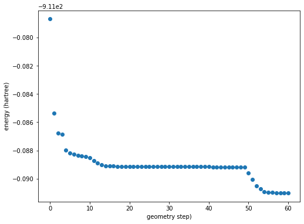
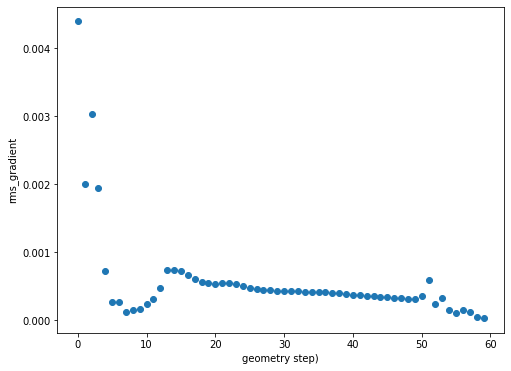

.. _recipe_09:

======================================
Reading and Writing ORCA Files
======================================

- ``import cctk`` is assumed.
- *cctk* was originally designed with Gaussian in mind, but supports basic writing of ORCA input files and parsing of ORCA output
- The default print level in ORCA ``! NormalPrint`` is recommended for parsing with cctk
- Note that ``! MiniPrint`` may make Orca output files unreadable by cctk

"""""""""""""""""""""""""""""""""""""""
Writing a simple ORCA input file
"""""""""""""""""""""""""""""""""""""""

- In this recipe, we convert an ``.xyz`` file into an ORCA ``.inp`` file.
- *cctk* can only write single-geometry input files for ORCA

::

  read_path = "test/static/test_peptide.xyz"
  new_path = "test/static/test_peptide_copy.inp"
  file = cctk.XYZFile.read_file(read_path)

  header = "! aug-cc-pVTZ aug-cc-pVTZ/C DLPNO-CCSD(T) TightSCF TightPNO"
  variables = {"maxcore": 4000}
  blocks = {"pal": ["nproc 4"], "mdci": ["density none"]}
  cctk.OrcaFile.write_molecule_to_file(new_path, file.get_molecule(), header, variables, blocks)

- The parent ``.xyz`` is `test_peptide.xyz <./../test/static/test_peptide.xyz>`_.
- The resulting ``.inp`` is `test_peptide_copy.inp <./../test/static/test_peptide_copy.inp>`_.

""""""""""""""""""""""""""""""""""""""""""""""""
Writing an ORCA input file from a SMILES string
""""""""""""""""""""""""""""""""""""""""""""""""

- In this recipe we use the SMILES string of uridine to quickly generate an input file for geometry optimization and frequency calculation.
- Writing molecules from SMILES requires RDKIT which can be installed with ``pip install rdkit``

::

    write_path = "test/static/orca_uridine_opt_freq.inp"

    # define a smiles string
    SMILES = "C1=CN(C(=O)NC1=O)C2C(C(C(O2)CO)O)O"

    # define a cctk molecule from SMILES string
    mol = cctk.Molecule.new_from_smiles(SMILES)

    cctk.OrcaFile.write_molecule_to_file(write_path, mol, 
	    header="! b3lyp/G 6-31g(d) D3 CPCM(water) opt freq tightscf")

This writes `orca_uridine_opt_freq.inp <./../test/static/orca_uridine_opt_freq.inp>`_.

""""""""""""""""""""""""""""""""""""""""""""""""""""""""""""""""
Reading Output of ORCA Geometry Optimization
""""""""""""""""""""""""""""""""""""""""""""""""""""""""""""""""

Submission of the example input above returns: `orca_uridine_opt_freq.out <./../test/static/orca_uridine_opt_freq.out>`_
- Warning: parsing of `dipole_moment`, `mulliken_charges`, and `lowdin_charges` is not fully supported for relaxed scan jobs.

To access properties of the final structure in the geometry optimization::

  path = 'test/static/orca_uridine_opt_freq.out'
  file = cctk.OrcaFile.read_file(path)

  # to access a property from the final structure, we use tuple indexing
  # where `-1` represents the final structure
  energy = file.ensemble[-1, 'energy']
  # returns -911.091006238863

  # to access the all the properties for the final structure
  properties = file.ensemble.properties_list()[-1]
  # returns a dictionary of all accessible properties and their values for the final structure
  # {'energy': -911.091006238863,
  # 'filename': './test/static/orca_uridine_opt_freq.out',
  # 'iteration': 60,
  # 'scf_iterations': 6.0,
  # 'frequencies': [41.02, 60.16, 64.69, 106.05, ...]
  # 'enthalpy': -910.84749131,
  # 'gibbs_free_energy': -910.90399464,
  # 'temperature': 298.15,
  # 'quasiharmonic_gibbs_free_energy': -910.902280867151,
  # 'mulliken_charges': OneIndexedArray([-0.274128,  0.092336, -0.455099, ...]),
  # 'lowdin_charges': OneIndexedArray([-0.21586 , -0.015003, -0.018213, ...]),
  # 'dipole_moment': 5.04114}
  

To access the final geometry in the ensemble::

  mol = file.ensemble.molecule_list()[-1]

  #equivalently
  mol = file.get_molecule()
  # or
  mol = file.get_molecule(-1)

  # We can then do something with that geometry
  # For example, use it to write an input for a single point calculation

  write_path = "test/static/uridine_sp.inp"
  header = "! aug-cc-pVTZ aug-cc-pVTZ/C DLPNO-CCSD(T) TightSCF TightPNO"
  variables =  {"maxcore": "4000"}
  blocks = {"mdci": ["density none"], "pal": ["nproc 8"] }
  cctk.OrcaFile.write_molecule_to_file(write_path, mol, header, variables, blocks)

Which writes the file  `uridine_sp.inp <./../test/static/uridine_sp.inp>`_
  
We can also access the properties of all geometries in the ensemble with::

  file.ensemble.properties_list()
  # returns a list of dictionaries
  # each dictionary in the list corresponds to a geometry from the optimization
  # each dictionary contains property keys mapped to property values for the specified geometry.

To access a given property for each member of the ensemble::

  geom_iters = file.ensemble[:,'iteration']
  energy = file.ensemble[:, 'energy']
  rms_grad = file.ensemble[:, 'rms_gradient']

We can then plot the property as a function of optimization step:: 

  import matplotlib.pyplot as plt

  energy_figure = plt.figure(figsize=(8,6))
  plt.scatter(geom_iters, energy)
  plt.ylabel(f"energy (hartree)")
  plt.xlabel(f"geometry step")
  plt.close()

  rms_grad_figure = plt.figure(figsize=(8,6))
  plt.scatter(geom_iters, rms_gradient)
  plt.ylabel(f"rms_gradient")
  plt.xlabel(f"geometry step")
  plt.close()

Calling ``energy_figure`` returns:

Calling ``rms_grad_figure`` returns:

