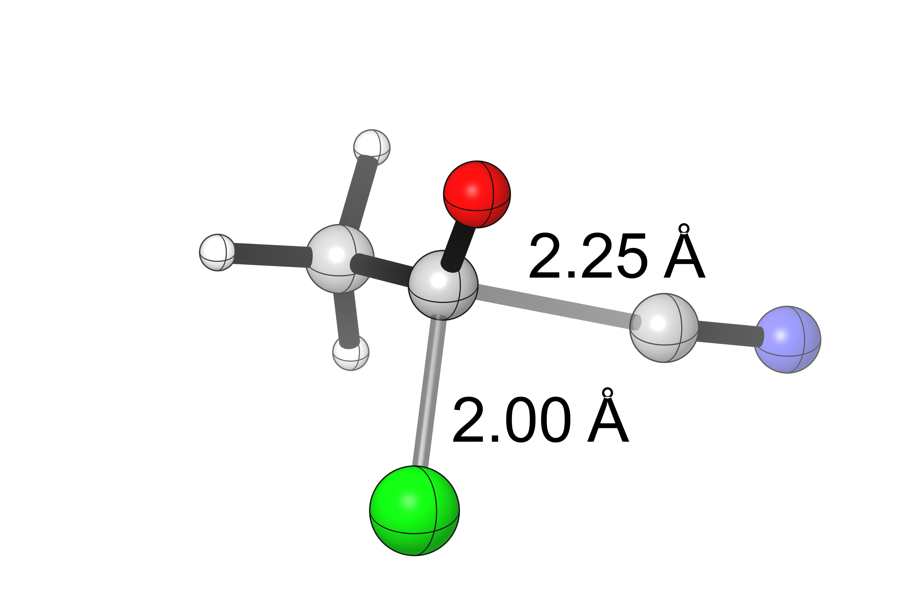

#### Tutorial 3: 2D Potential Energy Surface for Nucleophilic Acyl Substitution

Many reactions involve concomitant bond-forming and bond-breaking steps, but the precise timing of these steps is 
frequently difficult to ascertain. 
For instance, S<sub>N</sub>1 and S<sub>N</sub>2 mechanisms are differentiated by whether leaving group expulsion precedes
nucleophile attack or occurs concurrently. 
One common way to represent these mechanisms is through a More O'Ferrall–Jencks plot, 
which plots breaking and forming bond distances on a single graph. 

Although computational chemistry programs like Gaussian allow for "scans" along single bonds 
to generate 1D potential energy surfaces, 
graphing 2D potential energy surfaces is more challenging due to the need to generate input structures manually
and the large number of jobs required. 
*cctk* is therefore useful for generating the requisite input files and  parsing the large amounts of data generated.

For this example, we chose to examine nucleophilic acyl substitution. 
The traditional mechanism for substitution at an acyl group involves 
formation of a discrete anionic tetrahedral intermediate,
but in some cases robust experimental evidence suggests that the reaction instead proceeds via an S<sub>N</sub>2 mechanism
([*JACS*, **1987**, *109*, 6362–6368](https://pubs.acs.org/doi/pdf/10.1021/ja00255a021)). 
(For an excellent survey of this topic, see [*JOC*, **2004**, *69*, 7317–7328](https://pubs.acs.org/doi/pdf/10.1021/jo049494z)
and references therein.)

The reaction chosen for study was the reaction of acetyl chloride with cyanide anion:


This reaction is expected to display "non-textbook" behavior due to the presence of a good leaving group, 
which ought to destabilize the intermediate and promote concerted collapse. 
(For simplicity, no counterion effects or explicit solvation were considered)

##### Step 1: Generate Grid Points (`generate.py`)

From a suitable starting structure (`starting_structure.gjf`), grid points were generated by:

1. Varying the C1–Cl7 distance from 1.5 Å to 3.3 Å.
1. Varying the C1–C8 distance from 1.2 Å to 3.0 Å. 

This was accomplished through the following code:

```
path = "starting_structure.gjf"
cent = 1
lg = 7
nu = 8

file = GaussianFile.read_file(path)
mol = file.get_molecule()
mol.assign_connectivity()

footer = f"B {cent} {lg} F\nB {cent} {nu} F\n"

for lg_dist in np.arange(1.5, 3.3, 0.1):
    for nu_dist in np.arange(1.2, 3.0, 0.1):
        mol.set_distance(cent, lg, lg_dist)
        mol.set_distance(cent, nu, nu_dist)

        mol.check_for_conflicts()
        GaussianFile.write_molecule_to_file(f"scan_{int(round(lg_dist*100))}_{int(round(nu_dist*100))}.gjf", mol, "#p opt=modredundant b3lyp/6-31+g(d) scrf=(smd, solvent=tetrahydrofuran)", footer=footer)
```

This resulted in the creation of 324 distinct files, which were submitted to Gaussian. 

##### Step 2: Find Outliers and Resubmit (`analyze.py`/`resubmit.py`)

Although jobs submitted from this starting structure converged without problems, 
different starting structures occasionally lead to errors (collinearity, etc). 
While the failed jobs could be manually resubmitted, this is tedious and time-consuming on scale. 

Instead, the script `resubmit.py` can be used to identify failed jobs and microscopically perturb the structures 
without changing the key bond distances:

```
output_file.get_molecule().assign_connectivity()

lg_dist = output_file.get_molecule().get_distance(cent, lg)
nu_dist = output_file.get_molecule().get_distance(cent, nu)

output_file.get_molecule().perturb()
output_file.get_molecule().set_distance(cent, lg, lg_dist)
output_file.get_molecule().set_distance(cent, nu, nu_dist)
```

##### Step 3: Create More O'Ferrall–Jencks Plot (`plot.py`)

Once all jobs have successfully completed, it remains to visualize the data in a suitable way. 
The following code extracts the data from each file and puts it into the 2D-array `plot`, 
which can be visualized using `matplotlib`'s `imshow()`:

```
plot = np.zeros(shape=(18,18))

for filename in sorted(glob.glob(filenames, recursive=True)):
    if re.search("slurm", filename):
        continue

    output_file = GaussianFile.read_file(filename)
    energy = float(output_file.energies[-1]) * 627.509
    mol = output_file.get_molecule()

    lg_dist =  mol.get_distance(cent, lg)
    nu_dist =  mol.get_distance(cent, nu)

    idx1 = int(round((lg_dist - 1.5) * 10))
    idx2 = int(round((nu_dist - 1.2) * 10))
    plot[idx1][idx2] = energy
```

This is the output generated:


Based on this diagram, it appears that the reaction proceeds through an associative substitution mechanism, 
where bond forming precedes bond breaking but no long-lived tetrahedral intermediate is formed. 
Unlike a true S<sub>N</sub>2 reaction, the reaction does not proceed perfectly down the middle of the diagram,
but the absence of a distinct minimum in the top left indicates that any tetrahedral intermediate will be transient. 

Calculation of the transition state for this reaction at the same level of theory supports this hypothesis: 



(*v*<sub>i</sub> = 250.88 cm<sup>-1</sup>)

The lowest-energy path through the potential energy surface (i.e. the intrinsic reaction coordinate) might therefore
look something like this, where the transition state is represented as a dot:


A more careful analysis of this reaction, e.g. for publication, might examine: 
- Basis and functional dependence (especially the effect of augmented basis sets). 
- Different implicit solvation models.
- The effect of counterions and explicit solvation.
- Dynamics.

*Corin Wagen and Eugene Kwan*
