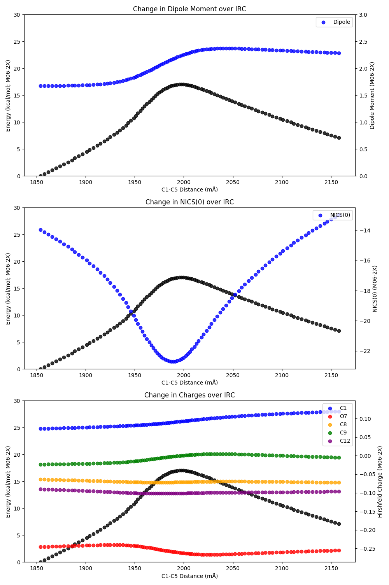

#### Tutorial 4: Analyzing Charges and NICS Along the Reaction Coordinate

Analysis of higher-order properties along a potential energy surface, although powerful, is frequently complicated by the multitude of jobs required. 
For instance, analyzing the change in atomic charges or aromaticity (as measured by nucleus-independent chemical shift, or NICS)
requires a separate job for each desired point, making manual setup and analysis challenging. 
In contrast, *cctk*'s ability to automatically extract structures and properties from output files
allows for detailed mechanistic investigations to be carried out with minimal brute-force labor. 

For this example, we chose to analyze the carbonyl-ene reaction of acetaldehyde and propylene. 
This reaction results in a net allylation of a carbonyl compound using inexpensive propylene gas as a surrogate
for more costly and promiscuous allylating reagents (like allyl-MgBr), 
but its utility is hampered by the slow rate of reaction: 26.4 kcal/mol for formaldehyde ([ref](https://pubs.acs.org/doi/abs/10.1021/ja00257a008)) and ~39 kcal/mol for aliphatic aldehydes (independent results). 
Effective catalysis of the carbonyl-ene reaction, guided by improved understanding of the transition state properties, could therefore lead to an effective and powerful synthetic method.

To study this reaction, we chose to investigate:
1. The dipole moment
1. Hirshfeld charges of key heavy atoms
1. NICS(0) of the ring formed by the two reactants

##### Step 1: Finding Points Along the Intrinsic Reaction Coordinate

The transition state for the reaction was found using conventional techniques (scanning the C1–C5 bond distance) 
and confirmed with a frequency calculation (*v*<sub>i</sub> = -1336 cm<sup>-1</sup>: 


The intrinsic reaction coordinate was followed backwards and forwards for 50 steps using the following input line:

```
#p irc=(calcfc, forward, maxpoints=50, stepsize=2) m062x/6-31g(d)
```

This resulted in the generation of two IRC `.out` files, each containing 51 distinct structures. 

##### Step 2: Generating Jobs to Calculate NICS(0)/Hirschfeld Charges (`generate_nics.py`/`generate_pop.py`)

The structures from the IRC `.out` files must first be extracted before new jobs can be written. 
To populate a `ConformationalEnsemble` object with the structures from the IRC, we used the `join_ensembles()` method.

```
for filename in glob.iglob(args["filename"], recursive=True):
    if re.search("slurm", filename):
        continue

    output_file = GaussianFile.read_file(filename)
    ensembles.append(output_file.molecules)

new_ensemble = ConformationalEnsemble.join_ensembles(ensembles)
```

The files are then generated (and named after the C1–C8 distance, which decreases monotonically along the IRC). 
For NICS calculation, a "ghost atom" must be added at the centroid of the ring 
(symbol "Bq", after the ghost Banquo from *Macbeth*). 
The Hirshfeld population jobs die if ghost atoms are used, so separate files are required. 

```
for mol in new_ensemble.molecules:
    mol.add_atom_at_centroid("Bq", [1, 7, 15, 12, 9, 8])
    cc_dist = mol.get_distance(1, 8)

    newfile = f"nics_{int(round(cc_dist*1000))}.gjf"
    GaussianFile.write_molecule_to_file(newfile, mol, "#p nmr m062x/6-31g(d)", None)
    print(f"generating {newfile}...")
 ```
 
 The jobs should then be submitted -- they should each take no more than a few minutes to run. 

##### Step 3: Analysis (`graph.py`)

Since the information in the `.out` files is not automatically extracted by `GaussianFile.read_file()`, 
more sophisticated methods for automated parameter extraction must be employed. 
`parse_gaussian.py` (imported as `parse`) contains several `awk`-like methods for locating blocks of text in `.out` files:
`find_parameter()` is useful for locating key values on a given line, 
while `search_for_block()` extracts larger blocks of text. 
(Note that `return_lines=True` must be set on `GaussianFile.read_file()` to generate the requisite `lines` variable). 

```
for filename in sorted(glob.glob(filenames, recursive=True)):
    if re.search("slurm", filename):
        continue

    (output_file, lines) = GaussianFile.read_file(filename, return_lines=True)
    dist = int(round(output_file.get_molecule().get_distance(1, 8) * 1000))

    energies[dist] = output_file.energies[-1]

    try:
        nics[dist] = -1 * parse.find_parameter(lines, "17  Bq   Isotropic", 8, 4)[0]
    except:
        pass

    try:
        dipole_line = parse.search_for_block(lines, "Dipole", "Quadrupole")
        fields = re.split(" +", dipole_line)
        fields = list(filter(None, fields))
        dipole[dist] = float(fields[-1])
    except:
        pass

    try:
        C1_charge[dist] = parse.find_parameter(lines, "     1  C", 8, 2)[-1]
        O7_charge[dist] = parse.find_parameter(lines, "     7  O", 8, 2)[-1]
        C8_charge[dist] = parse.find_parameter(lines, "     8  C", 8, 2)[-1]
        C9_charge[dist] = parse.find_parameter(lines, "     9  C", 8, 2)[-1]
        C12_charge[dist] = parse.find_parameter(lines, "    12  C", 8, 2)[-1]
    except:
        pass
```

With these values in hand, we can generate graphs showing change along the IRC: 



As shown by these images, the reaction proceeds without significant buildup of positive or negative charge 
and with minimal change in the overall dipole moment, 
indicating solvent polarity is unlikely to drastically raise/lower the rate of reaction. 
However, the drastic drop in NICS(0) around the transition state indicates that a true aromatic transition state is present,
consistent with [Schleyer's findings](https://pubs.acs.org/doi/10.1021/cr030088%2B) (see Section 3.8.5). 
Accordingly, pi–pi stacking or other aromatic-stabilizing interactions might be a fruitful avenue for catalyst design 
to accelerate this reaction. 

A more in-depth study might analyze the role of open-shell or multiconfigurational species 
([like in this paper](https://pubs.acs.org/doi/10.1021/jo502041f)),
as well as investigating how Lewis acid catalysts like Et<sub>2</sub>AlCl change the above properties. 

*Corin Wagen and Eugene Kwan*

