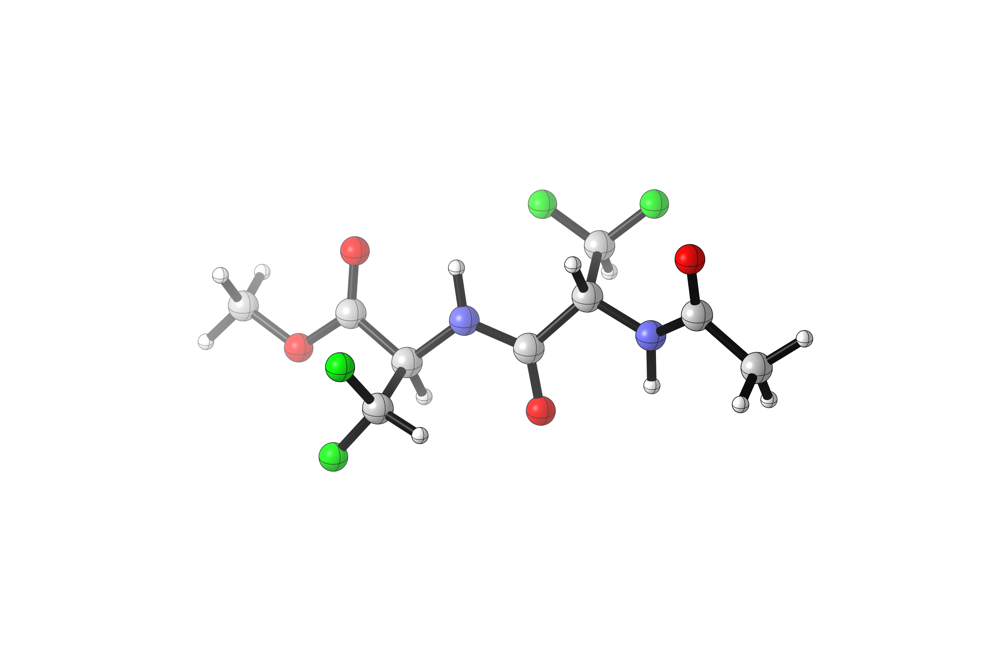

#### Tutorial 2: Performing a Conformational Search on a Dipeptide

Predicting the conformation of short peptides in solution is a challenging and unsolved problem. 
This "conformational heterogeneity" is both theoretically interesting and of practical import for the design and study of 
catalytically active oligopeptides (e.g., [Scott Miller's catalysts](https://pubs.acs.org/doi/10.1021/acscatal.8b03563)). 
In particular, the inclusion of unnatural amino acids in peptides could allow for stable conformations completely unlike those
obtained using canonical amino acids.

One such unnatural amino acid is difluoroalanine, which possesses a difluoromethyl group. 
The difluoromethyl group has [recently been implicated as a hydrogen bond donor](https://pubs.acs.org/doi/abs/10.1021/jacs.7b04457)
,albeit with distinct properties from classic hydrogen bond donors like hydroxyl or amino groups. 

To examine potential C–H and N–H hydrogen bonding interactions involving difluoroalanine, 
we chose to study the 31-atom dipeptide Ac–F2Ala–F2Ala–OMe. 

##### Step 1: Generate Conformations to Search (`generate_conformers.py`)

Although in principle there are a practically infinite number of distinct structures that can be generated from 31 atoms, 
in practice most of low-energy conformational space can be sampled 
by selecting a few key rotatable bonds and letting Gaussian's `opt` keyword do the rest. 

For the purposes of this study, we chose to study four key dihedral angles:
1. Rotating around F2Ala #1's alpha carbon with respect to the amide (C3–C5–C8–O6)
1. Rotating around F2Ala #2's alpha carbon with respect to the amide (H12–C11–C14–O16)
1. Rotating the difluoromethyl group in F2Ala #1 (N1–C3–C5–H7)
1. Rotating the difluoromethyl group in F2Ala #2 (N9–C11–C13–H15)

We also chose to sample:
1. *cis*/*trans* isomerism in F2Ala #1 (O27–C26–N1–H2)
1. *cis*/*trans* isomerism in F2Ala #2 (O8–C6–N9–H10)
1. Methyl ester conformation (O16–C14–O17–C18)

Each of the dihedral angles in the first list was set to 0, 120, and 240 degrees, while
each of the dihedral angles in the second list was set to 0 and 180 degrees (648 conformations in total).

To get our starting `Molecule` object, we read from an `.xyz` file. Since `.xyz` files don't contain connectivity information, 
we have to generate the bonds automatically:

```
output_file = XYZFile.read_file('Ac-F2Ala-F2Ala-OMe.xyz')
output_file.molecule.assign_connectivity()
```

The actual heavy lifting is done by the following code, which creates copies of the reference structure with the selected
dihedral angles set to new values. 

```
current_idx = 0
        for structure in structures:
            for theta in thetas:
                new_structures[current_idx] = copy.deepcopy(structure.set_dihedral(*angles[idx], theta, check_result=False))
                current_idx += 1
```

Finally, the script writes the resultant structures to `.gjf` files.

```
GaussianFile.write_molecule_to_file(f"conformer_{idx:05d}.gjf", molecule, "#p opt pm7", None)
```

The resultant Gaussian jobs (optimizations using the quick semiempirical `pm7` method) should converge quickly. 

##### Step 2: Analyze Low-Level Results and Resubmit at Higher Level (`extract_unique.py`)

After running all the jobs (which should take a few hours), we need to analyze the results. 
We do this by reading in all the files and adding the molecules to a `ConformationalEnsemble` object (along with their energies). 

```
for filename in sorted(glob.glob(filenames, recursive=True)):
    if re.search("slurm", filename):
        continue
   
    try:  
        output_file = GaussianFile.read_file(filename)
        
        if len(output_file.energies) > 0:
            mol = output_file.get_molecule() 
            ensemble.add_molecule(mol, energy=output_file.energies[-1]*627.509)
    except:
        print(f"skipping f{filename} due to error...")
```

The next step is to eliminate redundant conformers (since there aren't 648 distinct low-energy conformations of this peptide, 
many of the jobs will have converged to the same structure). 

By using a similarity threshold of 0.6, 166 distinct structures can be obtained. 

```
print(f"{len(ensemble.molecules)} conformers before elimination of redundant")
ensemble.eliminate_redundant(cutoff=0.6)
print(f"{len(ensemble.molecules)} conformers after elimination of redundant")
```

Finally, all the conformers within 10 kcal/mol of the `pm7` global minimum are resubmitted using DFT and implicit solvation. 

```
best_confs = ensemble.get_within_cutoff(cutoff=10)
for idx, molecule in enumerate(best_confs):
    GaussianFile.write_molecule_to_file(f"conformer_v2_{idx:03d}.gjf", molecule, "#p opt freq=noraman m062x/6-31g(d) scrf=(smd,solvent=diethylether)", None)
```

The script also outputs the energy and key dihedral angles for all 166 distinct conformers. 

##### Step 3: Analyze High-Level Results (`analyze_final.py`)

The high-level results can be subjected to the same elimination of redundant conformers, which yields 7 final structures. 
The lowest-energy structure is the linear form, but several other structures contain close N–H to C=O contacts. 
None of the structures studied appears to contain a close C–H to C=O contact, indicating that difluoromethyl hydrogen bonding
is not significant in this structure. 
Instead, the difluoromethyl groups appear to be oriented so as to minimize the overall molecular dipole.

Although we chose input structures with a 10 kcal/mol difference in energies, the output files are all within roughly 5 kcal/mol (∆G). This may be due to increased shielding of dipole/dipole interactions due to implicit solvation. 

```
(cctk) [dipeptide_conf_search]$ python analyze_final.py "output/*v2*.out"
12 conformers before elimination of redundant
7 conformers after elimination of redundant
writing final conformers to disk as ``conformer_final_xx.gjf``...
Molecule    Energy      D[1, 3, 5, 7]  D[9, 11, 13, 15]  D[5, 3, 6, 8]  D[12, 11, 14, 16]
0            00.000            066.23            313.11            113.17            235.38
1            00.140            310.90            308.97            121.98            048.58
2            00.616            172.56            309.14            359.35            047.92
3            00.717            064.58            186.38            019.56            241.59
4            01.803            294.45            183.31            019.67            074.00
5            04.466            174.92            302.01            000.30            041.05
6            05.245            060.83            309.23            039.52            240.81
```

The lowest energy structure (`conformer_final_00.gjf`) is pictured here—but three other conformations are nearly isoenergetic, so clearly there are many structures which could be relevant to reactivity through a Curtin–Hammett-type scenario. 



*Corin Wagen and Eugene Kwan*
