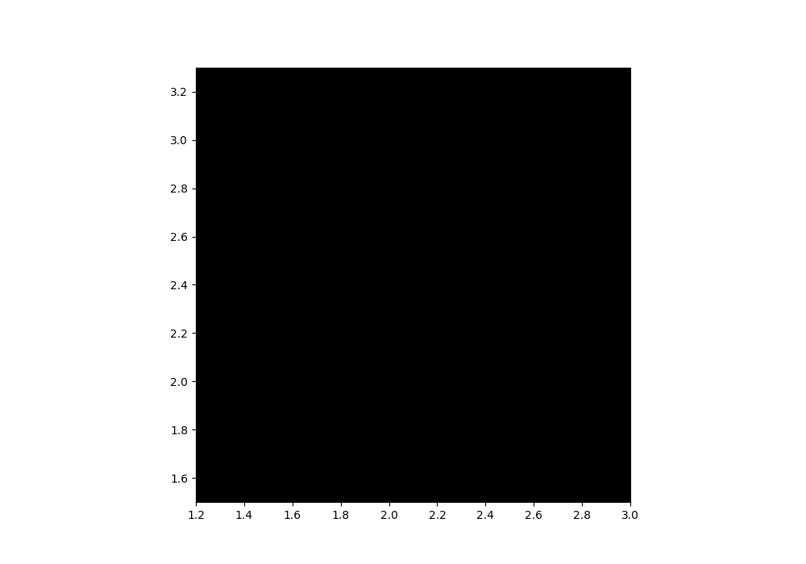
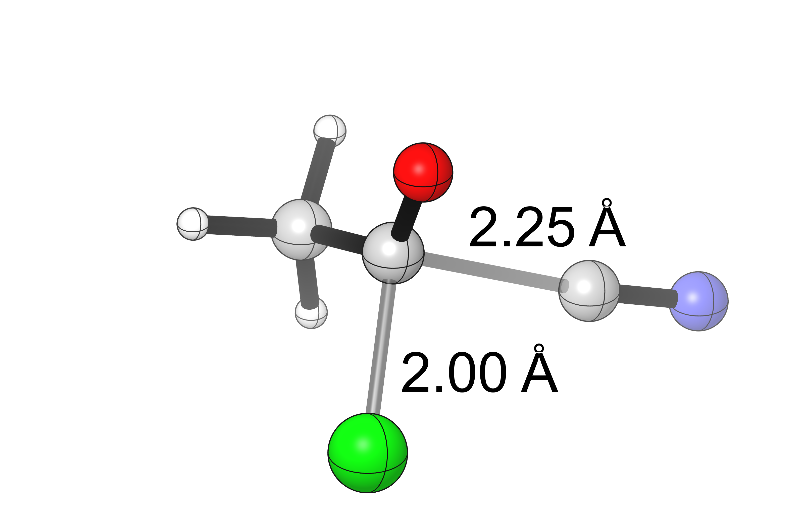

#### Tutorial 3: 2D Potential Energy Surface for Nucleophilic Acyl Substitution

Many reactions involve concomitant bond-forming and bond-breaking steps, but the precise timing of these steps is 
frequently difficult to ascertain. 
For instance, SN1 and SN2 mechanisms are differentiated by whether leaving group expulsion precedes
nucleophile attack or occurs concurrently. 
One common way to represent these mechanisms is through a More O'Ferrall–Jencks plot, 
which plots breaking and forming bond distances on a single graph. 

Although computational chemistry programs like Gaussian allow for "scans" along single bonds 
to generate 1D potential energy surfaces, 
graphing 2D potential energy surfaces is more challenging due to the need to generate input structures manually
and the large number of jobs required. 

For this example, we chose to examine nucleophilic acyl substitution. 
The traditional mechanism involves formation of a discrete anionic tetrahedral intermediate,
but in some cases this intermediate is thought immediately with expulsion of the leaving group,
resulting in a net concerted reaction. 

The reaction chosen for study was the reaction of acetyl chloride with cyanide anion:

(for simplicity, no counterion effects or explicit solvation were considered)

##### Step 1: Generate Grid Points (`generate.py`)

From a suitable starting structure, 

##### Step 2: Find Outliers and Resubmit (`resubmit.py`)

##### Step 3: Create More O'Ferrall–Jencks Plot (`plot.py`)

